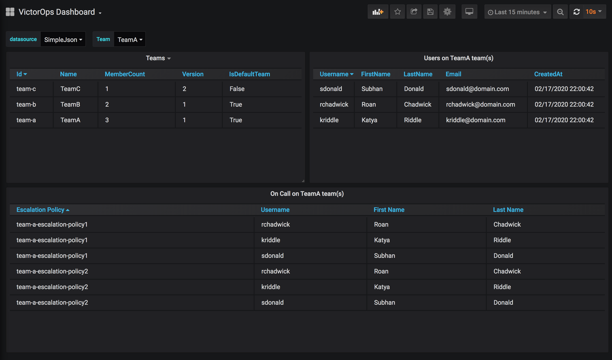
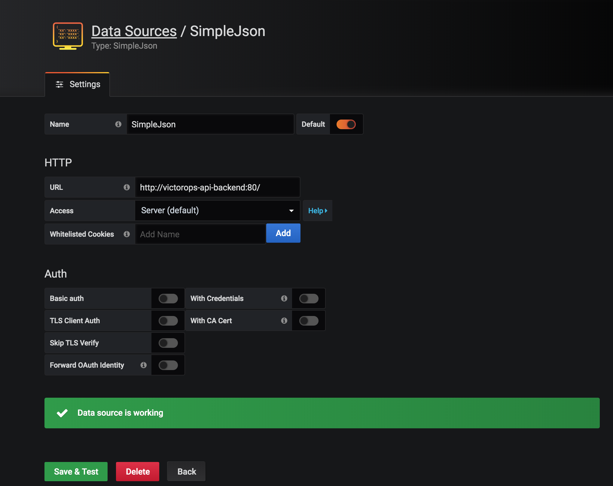

# Victor Ops Grafana Datasource Backend

```
NOTE: This project is currently under development.
```

The VictorOps Grafana Datasource is a backend service created to overcome the VictorOps Api limitations and 
bring your teams, users and on call schedules into your Grafana dashboards.



## How does it work?

Run the VO Api Backend service and connect with [Victor Ops Api](https://help.victorops.com/knowledge-base/api/). Then 
use the [Grafana Simple Json Backend](https://github.com/grafana/simple-json-datasource) to visualize your Victor Ops data.

## How to use?

### Run the api backend 

Run with docker-compose
```
docker-compose build
docker-compose up -d
````

Or Run it in [Docker](https://hub.docker.com/repository/docker/raulchall/victorops-grafana-ds-backend)

```
docker run -e AppMode=standalone -e LogLevel=Error -e DatabaseName=VictorOpsMetadataDb -P raulchall/victorops-grafana-ds-backend
```

Or Build and run from source (Requires dotnet SDK 3.1)

```
cd victorops-api-backend/src
dotnet build
dotnet path/to/VictorOpsBackendApi.dll
```

### Deploy Grafana with Grafana Simple Json Backend

To connect to the VictorOps Grafana Datasource Backend from Grafana we use the [Grafana Simple Json Backend](https://github.com/grafana/simple-json-datasource). You can find an example of how to install this plugin in grafana [here](/grafana/Dockerfile) or follow the Grafana [documentation](https://grafana.com/docs/grafana/latest/plugins/installation/).

### Setup the datasource

Setup Grafana Simple Json Backend](https://github.com/grafana/simple-json-datasource) url to point to the root of your 
deployment for the VictorOps Grafana Datasource Backend. 



### Import the example dashboard

Import the [example dashboard](dashboards/victorops-dashboard.json)

## Configuration

### Standalone Mode

Standalone mode runs the backend as a single service, uses in-memory storage and no external broker is required for 
task coordination. To run in standalone mode pass in the environment variable `AppMode=standalone`.

Example environment:

```
LogLevel=Error
AppMode=standalone
VictorOpsApiId=your-vo-api-id-here
VictorOpsApiKey=your-vo-api-key-here
DatabaseName=VictorOpsMetadataDb
```

### HA Mode (Beta)

HA mode allows you to run the VictorOps Grafana Datasource Backend with more than one instances. It requires a centralized
[PostgreSQL](https://www.postgresql.org/) database for storing the metadata retrieved from VictorOps and the
tasks each instance is required to run to keep this metada up to date. It also requires a Redis server that
serves as a remote broker for task locking coordination between multiple instances.

Example environment:

```
LogLevel=Error
VictorOpsApiId=your-vo-api-id-here
VictorOpsApiKey=your-vo-api-key-here
DatabaseName=VictorOpsMetadataDb
RedisEndpoints=redis:6379
DatabaseHost=postgresql-db
DatabaseUser=admin
DatabasePassword=admin
DatabasePort=5432
```

## Contributing

Same, same. Add [issues or feature requests](https://github.com/raulchall/victorops-grafana-datasource-backend/issues). Send me a PR. 

